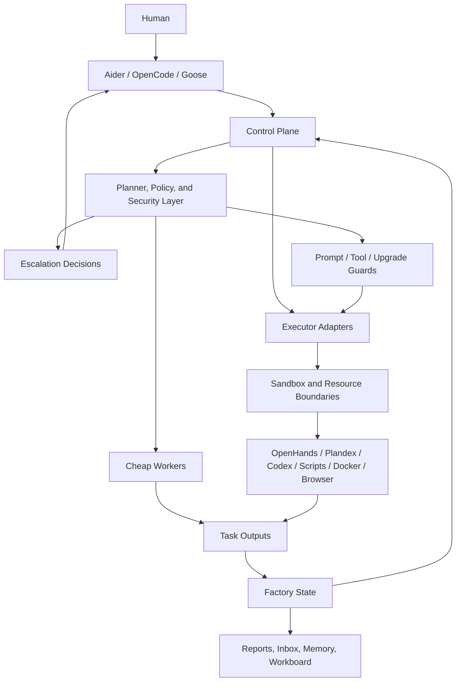

# MetaForge OS Architecture

MetaForge OS is the project umbrella for a layered local automation stack. The key design rule is simple: chat is the interface, but persisted state is the source of truth.

## System View



## Core Principle

`chat != state`

- Chat is where the operator gives intent.
- The controller is the only trusted mutation entrypoint.
- Factory state stores memory, policy, task history, and escalations.
- Workers are replaceable execution lanes rather than the system identity.

## Main Layers

### 1. Control and Entry Surfaces

- `D:\codex\orchestrator-mvp\tools\codex_control.py`
- `D:\codex\factoryctl.cmd`
- `D:\codex\opencode.cmd`

`Aider` is the primary interactive coding entry outside this workspace.
`OpenCode` and `Goose` are control shells.

These commands expose status, inbox, dispatch, and maintenance actions for the operator and control shells.

### 2. Control and Planning Layer

- task dispatch
- project-memory lookup
- capability routing
- cognitive security checks
- approval and escalation decisions
- self-improvement governance
- tool, workspace, and upgrade policy enforcement

This layer decides what should run, which worker or adapter should handle it, and when a task should stop and wait for review.

### 3. Execution Layer

- cheap workers
- reviewer and tester roles
- local scripts and runtime adapters
- sandboxed execution lanes
- resource and workspace boundaries
- reusable Docker build sandboxes and VMware guest validation profiles
- browser execution adapters

Primary execution tools are expected to be replaceable:

- `Codex`
- `OpenHands`
- `Plandex`
- `Docker`
- `browser`
- local scripts
- human review

The reusable build/runtime contract is documented in:

- `D:\codex\METAFORGE_OS_DOCKER_VMWARE_REUSE_TEMPLATE.md`

This layer does the bounded work. It is intentionally replaceable.

### 4. Persistent State Layer

- `D:\codex\orchestrator-mvp\data\context_kernel.json`
- `D:\codex\orchestrator-mvp\data\hot_context.json`
- `D:\codex\orchestrator-mvp\data\tasks.json`
- `D:\codex\orchestrator-mvp\data\escalation_inbox.json`
- `D:\codex\orchestrator-mvp\data\approval_policy.json`
- `D:\codex\orchestrator-mvp\data\audit_log.json`
- `D:\codex\orchestrator-mvp\data\guard_policy.json`

This layer is what makes the system durable across sessions.

## Security Subsystem

MetaForge OS security is a first-class subsystem, not an operator-side convention.

It is split into four planes:

- cognitive security
- runtime security
- system security
- evolution security

The active design document is:

- `D:\codex\METAFORGE_OS_SECURITY_FRAMEWORK.md`

## Operating Rules

1. Do not treat the UI or chat transcript as the source of truth.
2. Read and mutate state through the controller.
3. Use cheap local execution first.
4. Enforce prompt, tool, workspace, and upgrade guards before execution.
5. Escalate for contradictions, risk, repeated failures, or irreversible actions.
6. Persist outputs and audit evidence so later runs do not depend on hidden conversation state.

## Daily Control

```powershell
D:\codex\factoryctl.cmd light-status
D:\codex\factoryctl.cmd operator-report
D:\codex\factoryctl.cmd inbox --open-only
D:\codex\factoryctl.cmd run-meta
D:\codex\factoryctl.cmd run-evolution
```

Default status commands should stay cache-backed. Add `--refresh` only when you need a live recomputation of control-layer summaries.
