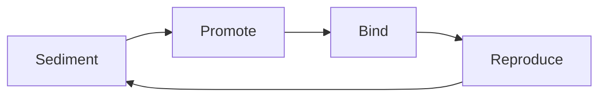

# MetaForge OS Memory Muscle Memory

This document defines how memory turns into habit, not just archive.

## Purpose

MetaForge memory is useful only when it repeatedly changes planning, routing, verification, and continuity decisions under the same conditions.

The system therefore treats memory as a four-stage operational loop:

1. Sediment
2. Promote
3. Bind
4. Reproduce

## Four-stage loop

### 1. Sediment

Raw events become candidate memory objects.

Inputs:

- logs
- reports
- dialogue summaries
- task results
- validation outputs
- state snapshots

Expected output:

- a candidate object with type, scope, evidence, and reuse value

Pass condition:

- the item is structured enough to be reviewed without rereading the full raw source

### 2. Promote

Candidate memory becomes verified memory only when it is useful and defensible.

Promotion requirements:

- explicit type
- bounded scope
- evidence references
- no conflict with existing verified memory
- clear validity trigger
- practical reuse value

Pass condition:

- the item can enter `memory_objects.jsonl` as a verified object

### 3. Bind

Verified memory must affect live behavior.

Binding targets:

- planner
- dispatcher
- executor routing
- verification gates
- handoff generation
- identity and continuity checks

Pass condition:

- the memory shows up in a context package or gate decision, not only in archives

### 4. Reproduce

The system must re-use the memory correctly under similar future conditions.

Reproduction checks:

- recall returns the intended memory or a close match
- the memory changes the chosen action or validation path
- repeated similar situations follow the learned rule
- no stale cache or identity drift breaks the behavior

Pass condition:

- the same memory shape improves a later decision without manual re-instruction

## Operational invariants

- Candidate memory is not truth.
- Verified memory is truth only inside its scope and validity window.
- Bound memory must alter execution or validation, not just appear in summaries.
- Reproduction without drift is the real proof of muscle memory.

## Acceptance metrics

- `write_quality`
- `recall_hit_rate`
- `behavior_binding`
- `anti_drift`
- long soak stability

## Practical rule

If memory cannot change routing, verification, or continuity decisions, it is only an archive entry.
If memory repeatedly changes those decisions correctly, it is muscle memory.

## Fixed benchmark

The fixed benchmark is defined in [`D:\codex\knowledge\memory_muscle_benchmark_v1.json`](D:/codex/knowledge/memory_muscle_benchmark_v1.json) and evaluated by [`D:\codex\orchestrator-mvp\tools\memory_muscle_benchmark.py`](D:/codex/orchestrator-mvp/tools/memory_muscle_benchmark.py).

It checks:

- sediment quality
- promotion policy stability
- recall correctness
- context binding
- reproduce stability
