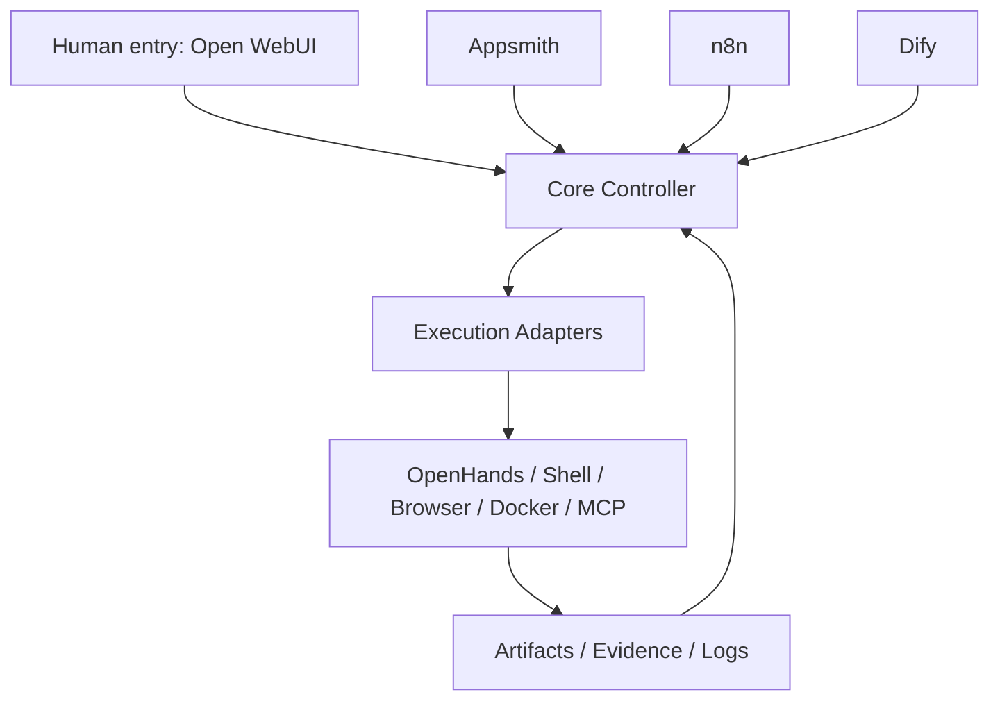

# Orchestrator MVP

Local-first multi-agent coding orchestrator for Windows plus WSL.

It takes a development task, enriches it with shared policy and project memory, routes it through a bounded planner and worker loop, and persists the resulting state for later runs.

## Vision

Build a practical agent orchestration layer for local software work:

- plan tasks with a supervisor model
- run cheap workers for routine coding and analysis
- execute local tools through PowerShell, WSL, or other adapters
- persist shared memory, policy, task history, and dialogue memory outside chat state
- escalate only when risk, ambiguity, or repeated failures justify it

This repository is an MVP, not an AGI claim. The goal is a reproducible local delivery loop with explicit state and bounded automation.

## Demo

Current MVP loop:

1. Submit a task through Codex control or the dispatch CLI.
2. The orchestrator attaches policy, capability, project context, and shared dialogue hints.
3. A planner selects a route and optional worker lane.
4. Local execution and reports are persisted under `data/`.
5. Codex or another operator reviews status, escalations, and outputs.

Example artifacts already produced in this repo:

- persisted runtime state in `data/tasks.json`, `data/context_kernel.json`, `data/dialogue_memory.json`, and `data/policy.json`
- a generated smoke-test report at `data/reports/smoke-demo.md`

## Architecture



Control topology:

- `Core Controller` is the SSOT for state, policy, queue, memory, verification, and audit
- `Open WebUI` is the human entry surface and runs as a dedicated control-entry stack
- `Appsmith` is the control surface for dashboards, approvals, and manual intervention
- `n8n` handles system automation, external events, and notifications
- `Dify` handles AI workflows and business-facing agent flows
- `OpenHands` handles code execution, tests, and artifact production
- `GET /integrations/status` reports live connectivity for configured instances

The machine-readable contract lives in `GET /topology` on the controller API.

Core runtime surfaces:

- `app/main.py`: FastAPI control plane
- `app/controller_api.py`: MetaForge Controller API with a bounded OpenAPI tool surface
- `app/controller_api.py` also exposes `GET /topology` for the canonical control-layer contract
- `tools/codex_control.py`: Codex-first operator commands
- `tools/dispatch_task.py`: terminal dispatch entrypoint
- `tools/dialogue_memory.py`: local dialogue ledger and shared conversation summary
- `data/`: persisted tasks, policy, project memory, dialogue memory, reports, and escalation state

Executor-pluggable surfaces:

- `app/executor_routing.py`: task-to-executor route resolution
- `app/executor_adapter.py`: executor adapter interfaces and local stubs
- `contracts/executors/executor_registry.json`: supported executors and capability flags
- `contracts/executors/routing_policy.json`: routing rules for task selection
- `contracts/executors/verification_policy.json`: verification levels and required checks

LinkWork is wired as an isolated execution-pool branch for bounded handoff tasks:

- `linkwork_executor` accepts report and bundle-style tasks without taking control-plane ownership
- the default verification boundary still stays in MetaForge
- registry and routing rules remain the source of truth for task admission
- `ORCH_LINKWORK_COMMAND=D:\codex\bin\linkwork.cmd` launches the local LinkWork bridge, which can either prepare a standardized handoff bundle locally or forward to a real upstream LinkWork CLI when `LINKWORK_TARGET_COMMAND` is set
- use `python tools/linkwork_smoke.py` to verify the configured LinkWork command returns the standard result envelope

## Quickstart

1. Sync the development environment.

```powershell
python tools/python_tooling.py sync
```

Fallback when you only want the legacy `pip` path:

```powershell
python -m pip install -r requirements.txt
```

2. Start the API.

```powershell
powershell -ExecutionPolicy Bypass -File .\run.ps1
```

3. Start the MetaForge Controller API when you want the dedicated OpenAPI tool surface.

```powershell
powershell -ExecutionPolicy Bypass -File .\run-controller-api.ps1
```

If you want Open WebUI and the controller API together as the control entry stack:

```powershell
powershell -ExecutionPolicy Bypass -File .\run-control-entry.ps1
```

Open WebUI registration assets:

- `docs/openwebui_controller_tool_registry.json`
- `docs/openwebui_controller_tool_registry.md`
- `docs/openwebui_control_entry.md`
- `docs/openwebui_first_run.md`

Smoke check:

```powershell
powershell -ExecutionPolicy Bypass -File .\run-control-entry-smoke.ps1
```

Canonical control topology:

- `GET /topology`
- `GET /integrations/status`
- `docs/control_topology.md`
- `docs/external_instances.md`

Open WebUI is exposed on `http://127.0.0.1:3001`.
The model source for Open WebUI is the local gateway at `http://model-gateway:8711`, which exposes only the allowlisted models.

4. In another terminal, inspect system status.

```powershell
D:\codex\tools\python311-embed\python.exe .\tools\codex_control.py status
```

Cached status commands are the default control-plane entrypoint. Append `--refresh` when you explicitly need live recomputation.

5. Optional: sync the current Codex dialogue into shared memory.

```powershell
D:\codex\factoryctl.cmd dialogue-sync --session-id codex-main --workspace D:\codex --summary "Current session summary" --user-message "..." --assistant-message "..." --topic memory --decision "next step"
```

6. Dispatch a sample task.

```powershell
D:\codex\orchestrator-mvp\.venv\Scripts\python.exe D:\codex\orchestrator-mvp\tools\dispatch_task.py "Review the current repo and suggest the next safe step." --repo-path D:\codex\generated\toy-os-demo --caller terminal
```

7. Prove the minimal execution kernel without planner, reviewer, control layer, or daemon.

```powershell
D:\codex\factoryctl.cmd execution-kernel-smoke --workspace D:\codex\generated\execution-kernel-smoke
```

### Execution backends

The local executor now supports both Open Interpreter and Docker as first-class backends.

- set `ORCH_SHELL_BACKEND=open-interpreter` to route shell steps through Open Interpreter
- set `ORCH_DOCKER_IMAGE=python:3.11-slim` to control the container image used for Docker worker runs
- set `ORCH_ENABLE_REAL_EXECUTION=true` when you want the orchestrator to execute rather than simulate

## What Works

- FastAPI control plane with task and status endpoints
- persisted task, policy, project memory, and dialogue memory
- Codex-first control commands for status, inbox triage, meta loops, and dialogue sync
- dispatch flow for terminal and editor integrations
- local execution hooks for PowerShell, WSL, and other adapters
- a direct execution-kernel smoke path that produces deterministic local artifacts without planner or daemon involvement
- shared Codex dialogue memory bridged into MetaForge snapshots and context packages
- Perplexity-backed Internet Knowledge snapshots for research-mode tasks
- lightweight CI and QA checks

## Constraints

- approval is still largely policy-based rather than inbox-driven
- worker outputs are not yet a fully isolated patch-application pipeline
- automatic capture of Codex desktop thread transcripts still depends on host-side export or wrapper integration
- some routes and capability matches still need tighter task-type validation
- this repo currently favors local operator supervision over unattended autonomy

## Validation

Local verification:

```powershell
python tools/python_tooling.py qa
python tools/python_tooling.py ruff-check
```

OpenCode executor overrides:

- `ORCH_OPENCODE_API_KEY`
- `ORCH_OPENCODE_BASE_URL`
- `ORCH_OPENCODE_MODEL`
- `ORCH_OPENCODE_AGENT`

These environment variables override the `opencode_executor` runtime profile without changing the on-disk OpenCode config.

`codex_executor` remains as a legacy compatibility alias for older task records and registry snapshots.

By default, the OpenCode-backed executor is registered as `interaction_only`, so `opencode` acts as the control surface while execution is routed to other enabled executors.

LinkWork bridge overrides:

- `ORCH_LINKWORK_COMMAND`
- `ORCH_LINKWORK_ARGS`
- `ORCH_LINKWORK_TIMEOUT_SECONDS`
- `LINKWORK_TARGET_COMMAND`
- `LINKWORK_TARGET_ARGS`
- `LINKWORK_TARGET_TIMEOUT_SECONDS`

`bin/linkwork.cmd` is the default local bridge entrypoint. If `LINKWORK_TARGET_COMMAND` is set, the bridge forwards the job bundle to that upstream command and normalizes the JSON response back into the executor contract.

Optional type-checking pass:

```powershell
python tools/python_tooling.py ty-check
```

CI:

- `.github/workflows/ci.yml` runs the same QA path on pushes and pull requests
- `.github/workflows/github-auth-smoke.yml` can use either `GITHUB_TOKEN` or a GitHub App installation token for API smoke runs
- See `docs/github-automation.md` for the exact secret and variable names

## Roadmap

1. tighten routing so task type and provider selection are easier to trust
2. turn worker output into an explicit patch-and-validate loop
3. add a true human approval queue
4. isolate execution environments per task
5. improve release packaging for a cleaner public demo
